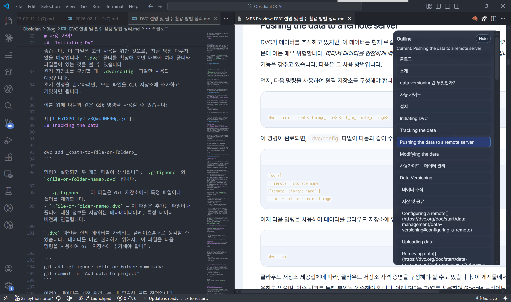

# Markdown Pattern Studio

Markdown 중심으로 문서를 작성하고, 템플릿/속성 문법으로 보고서·슬라이드 스타일 HTML을 빠르게 렌더링하는 도구입니다.

## 실행

요구사항: Node.js 18+

Windows에서는 `dev.bat`을 더블클릭해서 바로 실행할 수 있습니다.

```bash
npm start
```

브라우저에서 아래 주소를 엽니다.

```text
http://localhost:3188
```

## 핵심 기능

- Markdown 편집 + 실시간 HTML 미리보기
- 섹션 템플릿 클래스 14종 (`.cover`, `.dark`, `.half-bleed`, `.icon-list`, `.card`, `.two-column`, `.three-column`, `.stats`, `.compare`, `.timeline`, `.agenda`, `.message`, `.spotlight`, `.quote-slide`)
- 블록 속성 문법 `{: ...}` 지원
- 페이지 분리(`{: .page-break}`) 기반 Slides 모드
- CLI 변환(`npm run md2html -- ...`)
- **16종 네임드 팔레트** — 각 테마에 컬러 + 폰트 페어링 내장
- **70개 DESIGN.md 인사이트 라이브러리** — 회사별 디자인 문서를 수집/분석해 PPT형 Markdown의 디자인 방향으로 활용
- **`intent:` 프론트매터** — `pitch / report / reference / narrative` 문서 목적 선언
- Mermaid 렌더링 지원
- standalone HTML의 로컬 이미지 자동 Base64 내장 및 누락 이미지 fallback
- standalone HTML 아웃라인/코드 복사 버튼/Style 메뉴/Fill 줌 지원
- **Template Builder**: 웹 UI에서 섹션 템플릿을 시각적으로 선택·삽입하는 보조 패널
- **문서 외형 프리셋**: `Default`, `Clean`, `Flat`, `Reader`, `Print`와 배경/모서리/프레임/뷰어 크롬 옵션 지원
- `<details>/<summary>` 호환 변환: 기존 raw HTML details는 정적 note callout으로 보존하고, 새 문서에는 Markdown/callout/template 사용을 안내
- **VS Code File Browser**: 폴더 FOCUS, 추가 확장자 표시, Pinned/Recent/Hidden, 파일 검색·정렬·필터 지원

## 화면 구성과 사용 방법


처음 사용할 때는 아래 순서로 진행하면 됩니다.

1. 왼쪽 `패턴 가이드`에서 문법을 확인하고, `빠른 삽입` 버튼으로 자주 쓰는 블록을 넣습니다.
2. 가운데 `Markdown Editor`에서 문서를 작성합니다.
3. 오른쪽 `Live Preview`에서 즉시 결과를 확인합니다.
4. 상단 버튼으로 필요 작업을 실행합니다.
   - `Style`: 문서 외형 프리셋, 배경, 모서리, 프레임, 뷰어 크롬 조정
   - `샘플`: 예제 문서 로드
   - `MD 열기`: 로컬 Markdown 불러오기
   - `MD 저장`: 현재 Markdown 저장
   - `HTML 저장`: 렌더링 결과를 HTML로 저장

프리뷰 모드:

- `Rendered`: 보고서형 문서 보기
- `Slides`: 페이지 분리(`{: .page-break}`) 기준 슬라이드 보기
- `HTML`: 렌더된 원본 HTML 확인

## 템플릿/속성 문법

### 1) Front Matter

```yaml
---
title: 2026년 3월 운영 보고서
theme: midnight        # 16종 팔레트 중 선택
design: stripe         # 선택: 수집된 DESIGN.md 브랜드 slug
intent: pitch          # report | pitch | reference | narrative
appearance: clean      # default | clean | flat | reader | print
appearanceBackground: plain      # default | plain | transparent
appearanceRadius: none           # default | soft | none
appearanceFrame: lines           # default | lines | none
viewerChrome: minimal            # full | minimal | hidden
mode: web
toc: true
tocDepth: 3
pageWidth: 1120px
pageHeight: 720px
---
```

`intent:` 값별 동작:

| 값 | 용도 |
|----|------|
| `report` | 보고서 — 밀도 높은 레이아웃, 전체 목차 |
| `pitch` | 제안서/발표 — 큰 제목, 굵은 callout, 비주얼 템플릿 |
| `reference` | 문서/위키 — 탐색 우선, 정보 밀도 최적화 |
| `narrative` | 튜토리얼/에세이 — 여백 확보, 읽기 흐름 중심 |

외형 옵션은 `theme`/`design` 위에 얹는 표시 계층입니다. Markdown 내용은 그대로 두고, 리뷰·공유·인쇄 목적에 맞게 프레임 밀도와 뷰어 UI만 바꿀 수 있습니다.

| 키 | 값 |
|----|----|
| `appearance` | `default`, `clean`, `flat`, `reader`, `print` |
| `appearanceBackground` | `default`, `plain`, `transparent` |
| `appearanceRadius` | `default`, `soft`, `none` |
| `appearanceFrame` | `default`, `lines`, `none` |
| `viewerChrome` | `full`, `minimal`, `hidden` |

### 2) 섹션 속성 (heading 뒤 `{...}`)

```markdown
# 보고서 제목 {#cover .cover eyebrow="Monthly Report"}
## 핵심 요약 {#summary .two-column}
### KPI {#kpi .stats}
## 부록 {#appendix .card}
```

#### 신규 템플릿 3종

**`.dark` — 다크 슬라이드** (샌드위치 구조: 다크 커버 → 라이트 본문 → 다크 클로즈)

```markdown
# 제목 {#cover .cover .dark eyebrow="발표자료"}

## 마무리 {: .dark}
문의: hello@company.com
```

**`.half-bleed` — 하프 블리드 이미지** (이미지가 슬라이드 절반을 꽉 채움)

```markdown
## 제품 소개 {: .half-bleed side="right"}


이미지가 오른쪽 절반을 채우고, 이 텍스트는 왼쪽에 위치합니다.
```

**`.icon-list` — 아이콘 리스트** (`아이콘 | 제목 | 설명` 파이프 형식)

```markdown
## 주요 기능 {: .icon-list}

- 🚀 | 빠른 배포 | 수일 내 기능 출시
- 🔒 | 기본 보안 | Zero-trust 아키텍처 내장
- 📊 | 데이터 기반 | 실시간 분석 지원
```

#### 템플릿 선택 기준 (항목 수 기준)

| 항목 수 | 추천 | 사용 금지 |
|--------|------|---------|
| 2개 | `.compare` / `.two-column` | — |
| **3개** | **`.three-column`** 또는 `.timeline`(순서 있는 경우) | **`.compare`** — 카드 하나 고립 |
| 4개+ | `.icon-list`, `.stats`, `.agenda` | `.compare`, `.three-column` |
| 순서·단계 의미 있음 | `.timeline` (개수 무관) | `.compare` |

### 3) 블록 속성 (`{: ...}`)

```markdown
| 항목 | 목표 | 실적 |
| --- | ---: | ---: |
| 매출 | 100 | 124 |
{: .zebra .bordered .compact caption="월별 성과 비교" emphasis="last-col"}
```

표의 `caption`은 표 안의 병합 헤더가 아니라 표 위의 짧은 맥락 설명으로 렌더링됩니다. 컬럼 헤더에는 실제 비교 축만 두고, 긴 설명은 섹션 제목이나 본문 lead로 분리하는 것을 권장합니다.

```markdown

{: width="88%" align="center" caption="이미지 캡션"}
```

### 4) Callout

```markdown
> [!INFO] 메모
> 강조가 필요한 내용을 표시합니다.
```

## 페이지 분리 / Slides 모드

아래 마커를 사용하면 렌더링 결과가 다음 페이지로 분리됩니다.

```markdown
---
{: .page-break}
```

`page-break`가 2개 이상이면 앱/standalone HTML에서 Slides 탐색(Prev/Next, 키보드) 모드를 사용할 수 있습니다.

## Template Builder

웹 UI 우측 상단의 `Template Builder` 버튼(또는 VS Code Extension 내 패널)을 열면, 섹션 템플릿을 시각적으로 선택해 에디터에 바로 삽입할 수 있습니다.

- 커버, 두 컬럼, 세 컬럼, Stats, 카드 등 주요 템플릿을 버튼 클릭으로 삽입
- 삽입 위치는 현재 커서 기준 섹션 직후로 자동 설정
- VS Code Extension에서는 Webview 내 패널로 제공되며 저장 시 에디터에 반영

## CLI: Markdown -> HTML

```bash
npm run md2html -- <input.md>
```

예시:

```bash
# 기본 출력: 입력 파일과 같은 경로에 .html
npm run md2html -- test/notes.md

# 출력 경로/테마 지정
npm run md2html -- test/notes.md --out test/notes.cli.html --theme report --standalone

# DESIGN.md 브랜드 방향 적용
npm run md2html -- test/notes.md --out test/notes.vercel.html --design vercel --intent pitch --standalone

# 외형 프리셋/뷰어 크롬 지정
npm run md2html -- test/notes.md --appearance flat --appearance-radius none --viewer-chrome hidden --standalone
```

옵션:

- `--out`, `-o`: 출력 HTML 경로
- `--theme`: 팔레트 지정 (아래 16종 참고)
- `--design`: DESIGN.md 브랜드 preset 지정 (`vercel`, `stripe`, `airbnb` 등)
- `--intent`: `report | pitch | reference | narrative`
- `--appearance`: 외형 프리셋 (`default | clean | flat | reader | print`)
- `--appearance-background`: 배경 처리 (`default | plain | transparent`)
- `--appearance-radius`: 모서리 처리 (`default | soft | none`)
- `--appearance-frame`: 프레임 처리 (`default | lines | none`)
- `--viewer-chrome`: standalone 뷰어 UI 노출 수준 (`full | minimal | hidden`)
- `--mode`: 렌더 모드 (`web` 등)
- `--standalone` / `--no-standalone`: standalone HTML 셸 포함 여부
- `--base-dir <path>`: 상대 경로 자산 해석 기준 디렉터리
- `--embed-local-images` / `--no-embed-local-images`: 로컬 이미지를 HTML에 Base64로 내장할지 여부. standalone 출력은 기본적으로 내장합니다.
- `--mermaid` / `--no-mermaid`: Mermaid 강제 on/off

### 팔레트(테마) 16종

| 테마 | 성격 | 주 색상 | 폰트 페어링 |
|------|------|---------|-----------|
| `default` | 블루 기본 | `#5e6ad2` | 시스템 UI |
| `report` | 전문 블루 | `#3a63d6` | 시스템 UI |
| `slate` | 다크 프리미엄 | `#8cb4ff` | 시스템 UI |
| `paper` | 따뜻한 문서 | `#b26a2f` | 시스템 UI |
| `forest` | 자연 그린 | `#2d8a57` | 시스템 UI |
| `sunset` | 핑크/웜 | `#c04878` | 시스템 UI |
| `ocean` | 오션 블루 | `#2f74c8` | 시스템 UI |
| `mono` | 중성 미니멀 | `#424242` | 시스템 UI |
| `midnight` | 네이비 임원용 | `#1e2761` | Georgia / Calibri |
| `coral` | 코랄 볼드 | `#f96167` | Arial Black / Arial |
| `terracotta` | 따뜻한 흙 | `#b85042` | Cambria / Calibri |
| `charcoal` | 다크 미니멀 | `#36454f` | Trebuchet MS / Calibri |
| `teal-trust` | 차분한 틸 | `#028090` | Trebuchet MS / Calibri |
| `berry` | 리치 베리 | `#6d2e46` | Palatino / Garamond |
| `cherry` | 볼드 체리 | `#990011` | Impact / Arial |
| `sage` | 차분한 세이지 | `#84b59f` | Calibri |

> **팔레트 선택 원칙 (PPTX Skill 기준):** 하나의 색이 시각적 비중의 60–70%를 차지해야 합니다. 주제와 무관한 무난한 파란색 대신, 콘텐츠 성격에 맞는 팔레트를 선택하세요.

참고: 브라우저 보안 정책 때문에 `MD 열기`에서 파일의 실제 절대 경로를 제공하지 않는 환경이 있습니다. 이 경우 앱 미리보기는 원본 상대경로를 유지하고, CLI(`--base-dir`)를 사용하면 경로 해석을 강제할 수 있습니다. standalone CLI 출력은 로컬 이미지를 기본적으로 Base64로 내장하므로 HTML 파일만 옮겨도 이미지가 유지됩니다. 단, 큰 이미지는 HTML 파일 크기를 크게 만들 수 있고, 원격 이미지는 URL을 그대로 유지합니다. 로컬 이미지를 찾지 못하면 변환 품질 안내와 이미지 fallback 영역을 표시합니다.

로컬 이미지 내장 동작 검증:

```bash
npm run test:embed-images
```

## VS Code Extension: CLI Preview

`vscode-extension/` 폴더에는 CLI 렌더 결과를 VS Code Webview에서 보여주는 확장 소스가 포함되어 있습니다.

확장 동작 예시 화면:



이 화면은 VS Code에서 Markdown을 저장했을 때, 확장이 CLI 렌더링 결과를 Webview로 보여주고 Outline/페이지 네비게이션을 제공하는 상태입니다.

### 최근 VS Code Extension 배포 준비 (0.1.30 — 2026-06-20)

- **Marketplace publisher 설정**: `publisher`를 `datanewbie-labs`로 지정하고 GitHub repository/bugs/homepage 링크를 실제 저장소로 정리했습니다.
- **배포 문서 최신화**: VSIX 설치 예시, 확장 ID, 변경 이력 파일을 현재 배포 버전에 맞췄습니다.

### VS Code Extension 업데이트 (0.1.20 — 2026-06-13)

- **Inline `<small>` 지원**: Markdown 문장 안의 `<small>...</small>`을 caption 스타일로 렌더링하고, 내부의 굵게/코드/링크 같은 인라인 Markdown도 함께 처리합니다.
- **CLI/VS Code 번들 동기화**: 웹 렌더러와 VS Code 확장 번들 렌더러에 동일한 small 텍스트 처리와 스타일을 반영했습니다.

### VS Code Extension 업데이트 (0.1.19 — 2026-05-24)

- **Style 메뉴 연동**: VS Code Preview와 `MD Studio: Transform Markdown to Styled HTML`이 같은 외형 옵션을 사용합니다.
- **Fill 줌 추가**: Slides 모드에서 `Fill` 또는 `Ctrl+9`로 페이지를 가로폭에 맞춰 크게 볼 수 있고, Stack 전환 시 줌 상태가 자동 정리됩니다.
- **MD Studio File Browser 확장**: Markdown 외에 `.txt`, `.html`, `.json` 같은 추가 확장자를 표시할 수 있으며 비-Markdown 파일은 `Open in Editor`로 엽니다.
- **폴더 FOCUS 정리**: 우클릭 `FOCUS`는 MD Studio File Browser 안에서만 범위를 좁히며 VS Code Explorer의 `files.exclude`를 건드리지 않습니다. 이전 실험 빌드가 남긴 Explorer 제외 규칙은 `FOCUS 해제` 시 정리합니다.
- **Raw HTML 가드**: `<details>/<summary>`는 정적 note callout으로 변환하고, `<div>`, `<iframe>` 같은 지원하지 않는 raw HTML은 품질 경고로 노출합니다.
- **번들 렌더러 우선 사용**: 기본 CLI 설정에서는 확장에 포함된 최신 렌더러를 먼저 사용해 Style/Fill 컨트롤이 누락되지 않게 했습니다.

사용 흐름:

1. VS Code에서 Markdown 파일을 연 뒤 `Markdown Studio: Open Preview` 실행 (또는 Activity Bar의 책 아이콘 클릭)
2. 문서를 수정하고 저장(`Ctrl+S`)하면 자동 렌더링/갱신
3. 우측 Outline에서 섹션 이동, 하단 `Prev/Next`로 페이지 이동, `Stack`으로 문서형 보기 전환
4. `Fit`, `+`, `-` 버튼으로 현재 패널 크기에 맞춰 Slide/Stack 배율 조정

주요 동작:

- 명령: `Markdown Studio: Open Preview`
- 명령: `Markdown Studio: Refresh Preview`
- Markdown 저장 시 자동 갱신 (`mdStudioPreview.autoOnSave=true`)
- Markdown 저장(`Ctrl+S`) 시 커서 기준 섹션으로 Preview 동기화 (`mdStudioPreview.cursorSyncOnSave=true`)
- `file://` 자산 링크를 Webview URI로 변환
- **워크스페이스 외부 파일 지원**: 현재 워크스페이스에 없는 `.md` 파일도 번들 CLI로 바로 미리보기 가능
- **반응형 레이아웃**: Webview 패널이 좁아도 슬라이드·Outline이 실제 너비에 맞게 자동 조정
- **Slide/Stack Zoom**: 5% 단위 확대/축소, Fit은 화면 여유 공간을 사용해 100% 이상 확대 가능

### MD Studio File Browser (Activity Bar)

- Activity Bar의 **책 아이콘**을 클릭하면 워크스페이스의 Markdown 파일이 폴더 트리로 표시됨
- **파일 클릭** → 단일 Reader 패널에서 즉시 미리보기 (이전 패널 자동 교체)
- **우클릭 → Open in New Panel** → 기존 패널 유지하며 새 패널로 열기 (여러 파일 동시 비교)
- **우클릭 → Open in Editor** → 파일을 일반 VS Code 에디터에서 열기
- **우클릭 → Hide from Browser** → 관심 없는 파일/폴더를 워크스페이스별로 숨김
- **우클릭 폴더 → FOCUS** → 해당 폴더 아래 파일만 MD Studio File Browser에서 보기
- **우클릭 → Copy Path / Copy Relative Path / Copy Name** → 파일과 폴더 경로/이름 복사
- Command Palette의 **MD Studio: Open in Viewer**는 현재 열린 Markdown 파일을 대상으로 실행되며, 대상이 없으면 안내 메시지로 종료
- **검색 아이콘(🔍)** → 파일명·경로 기준 QuickPick 검색
- **필터 아이콘** → 전체, Pinned, Recent, 오래 안 고침, 긴 문서, 큰 파일 보기
- **정렬 아이콘** → 이름, 수정일, 생성일, 파일 크기, 문서 길이 기준 정렬
- **확장자 아이콘** → Markdown 외에 표시할 추가 확장자 선택 (`txt`, `html`, `json` 등)
- **눈 아이콘** → 숨김 항목 관리 및 숨김 전체 해제
- **Pinned / Recent 가상 섹션**으로 자주 보는 문서와 최근 문서를 빠르게 접근
- 파일 추가/삭제/수정 시 트리 자동 갱신 (300ms 디바운스)
- `Ctrl+S` 저장 시 사이드바 선택이 현재 프리뷰 파일로 자동 동기화

### Reader 내부 텍스트 검색

- 프리뷰 Webview에서 `Ctrl+F` → 우측 상단에 검색 바 등장
- 실시간 하이라이트 + `↑`/`↓` 또는 `Enter`/`Shift+Enter`로 결과 순환
- `Escape`로 닫기 및 하이라이트 제거

설정:

- `mdStudioPreview.autoOnSave` (기본값 `true`)
- `mdStudioPreview.cursorSyncOnSave` (기본값 `true`)
- `mdStudioPreview.nodePath` (기본값 `node`)
- `mdStudioPreview.cliScriptPath` (기본값 `scripts/md-to-html.mjs`)
- `mdStudioPreview.preferredViewMode` (기본값 `stack`, 값: `auto | slides | stack`)
- `mdStudioPreview.extraArgs` (기본값 `["--standalone"]`)
- `mdStudioPreview.stripEmailDisclaimer` (기본값 `false`)
- `mdStudioPreview.skillsDir` (기본값 `claude_skills/skills`)
- `mdStudioPreview.defaultSkill` (기본값 `md-presentation-composer`)
- `mdStudioFileBrowser.extraExtensions` (기본값 `[]`)

기본 `mdStudioPreview.cliScriptPath` 값을 사용할 때는 확장 내부에 번들된 CLI를 먼저 사용합니다.
워크스페이스 외부 파일도 동일하게 번들 CLI를 사용하며, `mdStudioPreview.cliScriptPath`에 절대 경로를 지정해 오버라이드할 수 있습니다.

패키징:

```bash
cd vscode-extension
npm install
npm run build
npm run package:vsix
```

설치:

```bash
code --install-extension .\markdown-pattern-studio-preview-0.1.30.vsix
```

### 커서 동기화 동작 (Ctrl+S)

기본값에서 Markdown을 저장하면 아래 순서로 동작합니다.

1. 현재 Markdown을 CLI로 다시 렌더링
2. 저장 시점의 에디터 커서 line을 기준으로 섹션(heading) 식별
3. Webview의 Outline 이동 로직을 재사용해 해당 섹션으로 이동

특징:

- 문단 단위가 아닌 섹션 단위 동기화
- Slides/Stack 모드 모두 기존 네비게이션 흐름 유지
- 같은 섹션에서 연속 저장 시 불필요한 재이동 최소화

끄고 싶을 때:

- VS Code Settings에서 `mdStudioPreview.cursorSyncOnSave`를 `false`로 변경

자세한 사용법/구조/트러블슈팅:

- [Extension Guide](vscode-extension/EXTENSION_GUIDE.md)

## HTML 변환 결과 캡처

아래 이미지는 Markdown을 HTML로 변환한 뒤(standalone) 브라우저에서 연 결과 예시입니다.


확인 포인트:

1. 우측 `Outline`에서 섹션 이동이 가능한지
2. 하단 `Prev/Next`로 페이지(슬라이드) 이동이 가능한지
3. `Stack` 버튼으로 문서형 보기 전환이 되는지

## 코드 복사 버튼 / 높이 제어

- 코드 블록은 기본적으로 `max-height: 360px` 기준으로 내부 스크롤됩니다.
- 코드 블록 속성 예시:
  - `{: maxHeight="420px" overflow="auto"}`
  - `{: height="280px"}` (숫자는 `px`로 자동 보정)
- 섹션 속성 예시:
  - `## 섹션 제목 {#section .card maxHeight="520px" overflow="auto"}`
- 앱 미리보기/저장 HTML/CLI standalone에서는 코드 헤더 `복사` 버튼을 지원합니다.

## 로컬 이미지 샘플

- 샘플 문서: `public/examples/sample.md`
- 경로 예시: ``

## AI Skills 사용법

이 저장소에는 Claude / Codex / Agents용 스킬 번들이 `ai_skills/`에 포함되어 있습니다.

```
ai_skills/
├── claude/    ← 편집 원본 (여기서 수정 후 sync.sh 실행)
├── agents/    ← 자동 동기화
└── codex/     ← 자동 동기화
```

스킬 동기화:

```bash
cd ai_skills && bash sync.sh
```

### md-presentation-composer 스킬

- 스킬 정의: `ai_skills/claude/skills/md-presentation-composer/SKILL.md`
- 참조 문서: `ai_skills/claude/skills/md-presentation-composer/references/`

| 참조 문서 | 역할 |
|----------|------|
| `quick-insert-catalog.md` | 템플릿·팔레트·스니펫 카탈로그 |
| `component-selection-rules.md` | KPI 카드/표/비교/콜아웃/기술 근거 슬라이드 선택 기준 |
| `document-design-rules.md` | 표·카드·목록 선택 기준 |
| `ppt-like-markdown-rules.md` | 슬라이드형 Markdown 덱 규칙 |
| `layout-orientation-rules.md` | 화면비 판단 규칙 |
| `validation-rules.md` | 검증 및 시각적 QA 체크리스트 |
| `design-md/design-md-insights.md` | 70개 DESIGN.md 통합 인사이트 |
| `design-md/design-md-archetypes.md` | 브랜드별 디자인 archetype 선택 가이드 |
| `design-md/design-md-decision-framework.md` | 문서 목적에 따른 디자인 방향 결정 프레임워크 |
| `design-md/design-md-to-ppt-rules.md` | DESIGN.md를 PPT형 Markdown으로 번역하는 규칙 |
| `design-md/manifest.json` | 70개 브랜드 slug, 토큰, 추천 theme/intent 인덱스 |

DESIGN.md 수집/분석 재생성:

```bash
npm run design:update
```

수집 원본은 `ai_skills/claude/skills/md-presentation-composer/references/design-md/raw/`에 저장하고, `ai_skills/sync.sh`로 `agents`/`codex`에 동기화합니다.

스킬 동작 프레임워크 (Whole Document First → Audit → Map → Commit → Verify):

1. **Whole Document First** — 전체 문서를 읽고 목적, narrative spine, content families, 보존할 artifact를 먼저 정리
2. **Component System** — evidence/KPI/code/table 처리와 사용할 표현 어휘를 문서 단위로 제한
3. **Audit** — 콘텐츠 유형과 밀도 분류 (텍스트 중심 / 데이터 중심 / 비주얼 중심)
4. **Map** — 콘텐츠를 레이아웃 아키타입에 할당 (커버/스탯/타임라인/아이콘리스트 등)
5. **Commit** — 콘텐츠 작성 전 팔레트 + `intent:` 먼저 확정
6. **Verify** — 시각적 QA 체크리스트 실행 후 완료 선언

사용 예시:

```text
md-presentation-composer를 사용해서 public/examples/sample.md를 보고서 톤으로 재구성해줘.
먼저 변경 요약/자동 삽입 후보/추천 화면비만 보여주고, 승인 후 최종본을 만들어줘.
```

참고:

- `.claude/`는 로컬 에이전트 설정 폴더이므로 기본적으로 커밋 제외 대상입니다.
- 공유/배포용 스킬은 `ai_skills/claude/` 아래에서 편집하고 `sync.sh`로 배포합니다.

## 디자인 쇼케이스

신규 팔레트·템플릿·샌드위치 구조를 한 번에 확인할 수 있는 데모 문서:

```bash
npm run md2html -- public/examples/design-showcase.md --theme midnight --intent pitch --standalone
```

`design-showcase.md`는 다음을 포함합니다:

- 다크 커버 + 라이트 본문 + 다크 클로즈 (샌드위치 구조)
- `.icon-list`, `.half-bleed`, `.stats`, `.compare`, `.agenda` 슬라이드
- `theme: midnight` + `intent: pitch` 적용 예시

## 관련 파일

- 서버: `server.js`
- CLI: `scripts/md-to-html.mjs`
- 코어 엔진: `public/core/engine.js`
- 외형 옵션: `public/core/appearance.js`
- 테마/스타일: `public/document.css`
- 샘플 문서: `public/examples/sample.md`
- 디자인 쇼케이스: `public/examples/design-showcase.md`
- 샘플 자산: `public/examples/assets/local-kpi-card.svg`
- AI 스킬: `ai_skills/claude/skills/md-presentation-composer/`

## 변경 이력

### VS Code Extension 0.1.30 — 2026-06-20

- Marketplace publisher를 `datanewbie-labs`로 지정
- repository/bugs/homepage 링크를 실제 GitHub 저장소로 정리
- 설치 가이드와 확장 ID 안내를 `datanewbie-labs.markdown-pattern-studio-preview` 기준으로 갱신
- 최신 VSIX: `vscode-extension/markdown-pattern-studio-preview-0.1.30.vsix`

### VS Code Extension 0.1.20 — 2026-06-13

- 문장 안의 `<small>...</small>`을 안전한 caption HTML로 렌더링하고, 내부 Markdown 인라인 서식을 지원
- standalone HTML과 VS Code 번들 CSS에 `.studio-document small` 스타일 추가
- CLI/렌더러 회귀 테스트로 raw HTML details 및 small 텍스트 처리 검증 보강
- 최신 VSIX: `vscode-extension/markdown-pattern-studio-preview-0.1.20.vsix`

### VS Code Extension 0.1.19 — 2026-05-24

- 웹/CLI/VS Code Preview에 공통 `appearance` 옵션을 추가하고, standalone HTML에도 Style 메뉴를 포함
- Slides 뷰어에 `Fill` 줌을 추가하고 Stack/Slides 전환 시 줌 overflow 상태를 초기화
- MD Studio File Browser에서 추가 확장자 표시, 비-Markdown `Open in Editor`, 폴더 FOCUS, FOCUS 해제를 지원
- 기본 CLI 설정에서 확장 번들 렌더러를 우선 사용해 최신 뷰어 컨트롤을 안정적으로 제공
- `<details>/<summary>`를 정적 note callout으로 변환하고 지원하지 않는 raw HTML 품질 경고를 추가
- `md-presentation-composer` 스킬에 raw HTML 금지와 details 대체 작성 규칙을 보강

### v0.3.1 — 2026-05-01 (PPTX-skill Design System)

**참조:** [Anthropic PPTX Skill](https://github.com/anthropics/skills/tree/main/skills/pptx), [Theme Factory Skill](https://github.com/anthropics/skills/blob/main/skills/theme-factory/SKILL.md), [Frontend Design Skill](https://github.com/anthropics/skills/blob/main/skills/frontend-design/SKILL.md), [Canvas Design Skill](https://github.com/anthropics/skills/blob/main/skills/canvas-design/SKILL.md)

**신규 기능**

- **팔레트 8종 추가** — `midnight`, `coral`, `terracotta`, `charcoal`, `teal-trust`, `berry`, `cherry`, `sage`. 각 테마에 컬러 변수 + 폰트 페어링(`--font-heading`, `--font-body`) 내장
- **타이포그래피 스케일** — `--font-size-title: 2.6rem` / `--font-size-section: 1.45rem` / `--font-size-body: 1rem` / `--font-size-caption: 0.78rem` (PPTX pt 크기 기준)
- **`.dark` 템플릿** — 액센트 컬러를 배경으로 쓰는 다크 슬라이드. 샌드위치 구조(다크 커버 → 라이트 본문 → 다크 클로즈)에 사용
- **`.half-bleed` 템플릿** — 첫 번째 이미지가 슬라이드 절반을 `object-fit: cover`로 꽉 채움. `side="right"` 속성으로 방향 전환
- **`.icon-list` 템플릿** — `🚀 | 제목 | 설명` 파이프 형식으로 아이콘 원형 + 헤더 + 설명 렌더링
- **`intent:` 프론트매터** — `report / pitch / reference / narrative`. CLI `--intent` 플래그로도 지정 가능

**디자인 안티패턴 수정 (슬라이드 모드)**

- 섹션 제목 하단 장식선(`border-bottom`) 제거
- 본문 텍스트/목록 좌측 정렬 강제
- 슬라이드 내부 최소 패딩 `2rem` 보장
- 콘텐츠 블록 간격 `1.25rem`으로 표준화

**AI 스킬 강화**

- `SKILL.md` 전면 재작성 — Audit → Map → Commit → Verify 프레임워크 도입
- `quick-insert-catalog.md` — 항목 수 기반 템플릿 선택 테이블 추가, `.compare` 3개 이상 사용 금지 명시
- `validation-rules.md` — 20개 항목 시각적 QA 체크리스트 추가
- `ai_skills/sync.sh` — claude → agents / codex 동기화

**VSIX**

- `vscode-extension/markdown-pattern-studio-preview-0.1.8.vsix` 빌드 완료 (98.68 KB)
