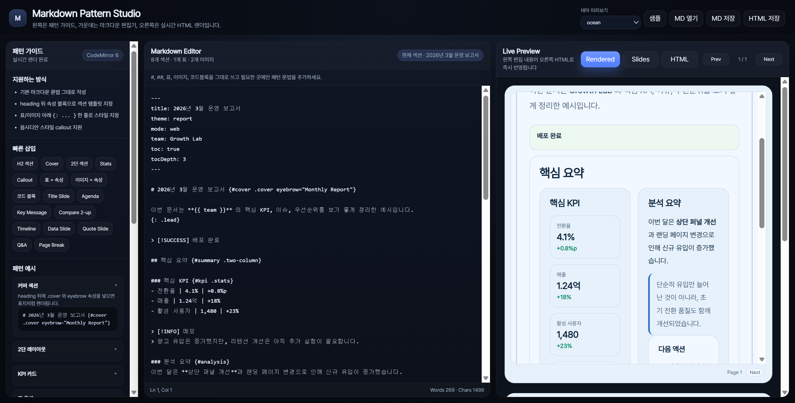
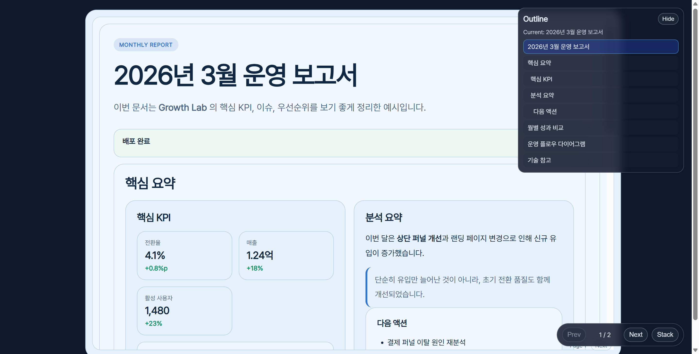

# Markdown Pattern Studio

Markdown 중심으로 문서를 작성하고, 템플릿/속성 문법으로 보고서·슬라이드 스타일 HTML을 빠르게 렌더링하는 도구입니다.

## 실행

요구사항: Node.js 18+

```bash
npm start
```

브라우저에서 아래 주소를 엽니다.

```text
http://localhost:3188
```

## 핵심 기능

- Markdown 편집 + 실시간 HTML 미리보기
- 섹션 템플릿 클래스(`.cover`, `.card`, `.two-column`, `.three-column`, `.stats` 등)
- 블록 속성 문법 `{: ...}` 지원
- 페이지 분리(`{: .page-break}`) 기반 Slides 모드
- CLI 변환(`npm run md2html -- ...`)
- Mermaid 렌더링 지원
- standalone HTML 아웃라인/코드 복사 버튼 지원

## 화면 구성과 사용 방법



처음 사용할 때는 아래 순서로 진행하면 됩니다.

1. 왼쪽 `패턴 가이드`에서 문법을 확인하고, `빠른 삽입` 버튼으로 자주 쓰는 블록을 넣습니다.
2. 가운데 `Markdown Editor`에서 문서를 작성합니다.
3. 오른쪽 `Live Preview`에서 즉시 결과를 확인합니다.
4. 상단 버튼으로 필요 작업을 실행합니다.
   - `샘플`: 예제 문서 로드
   - `MD 열기`: 로컬 Markdown 불러오기
   - `MD 저장`: 현재 Markdown 저장
   - `HTML 저장`: 렌더링 결과를 HTML로 저장

프리뷰 모드:

- `Rendered`: 보고서형 문서 보기
- `Slides`: 페이지 분리(`{: .page-break}`) 기준 슬라이드 보기
- `HTML`: 렌더된 원본 HTML 확인

## 템플릿/속성 문법

### 1) Front Matter

```yaml
---
title: 2026년 3월 운영 보고서
theme: report
mode: web
toc: true
tocDepth: 3
---
```

### 2) 섹션 속성 (heading 뒤 `{...}`)

```markdown
# 보고서 제목 {#cover .cover eyebrow="Monthly Report"}
## 핵심 요약 {#summary .two-column}
### KPI {#kpi .stats}
## 부록 {#appendix .card}
```

### 3) 블록 속성 (`{: ...}`)

```markdown
| 항목 | 목표 | 실적 |
| --- | ---: | ---: |
| 매출 | 100 | 124 |
{: .zebra .bordered .compact caption="월별 성과 비교" emphasis="last-col"}
```

```markdown

{: width="88%" align="center" caption="이미지 캡션"}
```

### 4) Callout

```markdown
> [!INFO] 메모
> 강조가 필요한 내용을 표시합니다.
```

## 페이지 분리 / Slides 모드

아래 마커를 사용하면 렌더링 결과가 다음 페이지로 분리됩니다.

```markdown
---
{: .page-break}
```

`page-break`가 2개 이상이면 앱/standalone HTML에서 Slides 탐색(Prev/Next, 키보드) 모드를 사용할 수 있습니다.

## CLI: Markdown -> HTML

```bash
npm run md2html -- <input.md>
```

예시:

```bash
# 기본 출력: 입력 파일과 같은 경로에 .html
npm run md2html -- test/notes.md

# 출력 경로/테마 지정
npm run md2html -- test/notes.md --out test/notes.cli.html --theme report --standalone
```

옵션:

- `--out`, `-o`: 출력 HTML 경로
- `--theme`: `report | default | slate`
- `--mode`: 렌더 모드 (`web` 등)
- `--standalone` / `--no-standalone`: standalone HTML 셸 포함 여부
- `--base-dir <path>`: 상대 경로 자산 해석 기준 디렉터리
- `--mermaid` / `--no-mermaid`: Mermaid 강제 on/off

참고: 브라우저 보안 정책 때문에 `MD 열기`에서 파일의 실제 절대 경로를 제공하지 않는 환경이 있습니다. 이 경우 앱 미리보기는 원본 상대경로를 유지하고, CLI(`--base-dir`)를 사용하면 경로 해석을 강제할 수 있습니다.

## HTML 변환 결과 캡처

아래 이미지는 Markdown을 HTML로 변환한 뒤(standalone) 브라우저에서 연 결과 예시입니다.



확인 포인트:

1. 우측 `Outline`에서 섹션 이동이 가능한지
2. 하단 `Prev/Next`로 페이지(슬라이드) 이동이 가능한지
3. `Stack` 버튼으로 문서형 보기 전환이 되는지

## 코드 복사 버튼 / 높이 제어

- 코드 블록은 기본적으로 `max-height: 360px` 기준으로 내부 스크롤됩니다.
- 코드 블록 속성 예시:
  - `{: maxHeight="420px" overflow="auto"}`
  - `{: height="280px"}` (숫자는 `px`로 자동 보정)
- 섹션 속성 예시:
  - `## 섹션 제목 {#section .card maxHeight="520px" overflow="auto"}`
- 앱 미리보기/저장 HTML/CLI standalone에서는 코드 헤더 `복사` 버튼을 지원합니다.

## 로컬 이미지 샘플

- 샘플 문서: `public/examples/sample.md`
- 경로 예시: ``

## claude_skills 사용법

이 저장소에는 Claude/Codex용 스킬 번들이 `claude_skills/`에 포함되어 있습니다.

- 스킬 루트: `claude_skills/skills`
- 예시 스킬: `claude_skills/skills/md-presentation-composer/SKILL.md`
- 참조 문서: `claude_skills/skills/md-presentation-composer/references/*`

사용 순서:

1. 사용자 프롬프트에서 스킬 이름을 명시합니다. (예: `md-presentation-composer`)
2. 에이전트가 해당 `SKILL.md`를 먼저 읽고, 필요한 `references/` 문서를 선택해 적용합니다.
3. 문서 변환 작업 시에는 먼저 변경안 제시 -> 승인 후 반영 순서로 진행합니다.

사용 예시:

```text
md-presentation-composer를 사용해서 public/examples/sample.md를 보고서 톤으로 재구성해줘.
먼저 변경 요약/자동 삽입 후보/추천 화면비만 보여주고, 승인 후 최종본을 만들어줘.
```

참고:

- `.claude/`는 로컬 에이전트 설정 폴더이므로 기본적으로 커밋 제외 대상입니다.
- 공유/배포용 스킬은 `claude_skills/` 아래에 두고 버전 관리하면 됩니다.

## 관련 파일

- 서버: `server.js`
- CLI: `scripts/md-to-html.mjs`
- 샘플 문서: `public/examples/sample.md`
- 샘플 자산: `public/examples/assets/local-kpi-card.svg`
