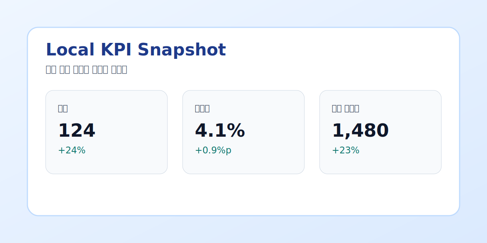
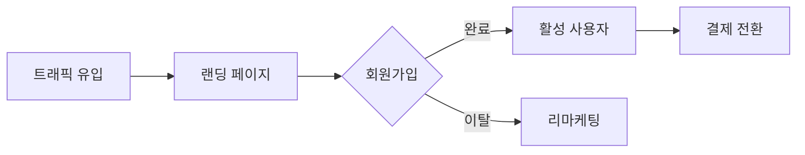

# 2026년 3월 운영 보고서 {#cover .cover eyebrow="Monthly Report"}

이번 문서는 **{{ team }}** 의 핵심 KPI, 이슈, 우선순위를 보기 좋게 정리한 예시입니다.
{: .lead}

> [!SUCCESS] 배포 완료

## 핵심 요약 {#summary .two-column}

### 핵심 KPI {#kpi .stats}
- 전환율 | 4.1% | +0.8%p
- 매출 | 1.24억 | +18%
- 활성 사용자 | 1,480 | +23%

> [!INFO] 메모
> 광고 유입은 증가했지만, 리텐션 개선은 아직 추가 실험이 필요합니다.

### 분석 요약 {#analysis}
이번 달은 **상단 퍼널 개선**과 랜딩 페이지 변경으로 인해 신규 유입이 증가했습니다.

> 단순히 유입만 늘어난 것이 아니라, 초기 전환 품질도 함께 개선되었습니다.

#### 다음 액션
- 결제 퍼널 이탈 원인 재분석
- 2차 리텐션 코호트 점검
- 운영 지표용 카드 템플릿 공통화

## 월별 성과 비교 {#performance}

| 항목 | 목표 | 실적 |
| --- | ---: | ---: |
| 매출 | 100 | 124 |
| 전환율 | 3.2 | 4.1 |
| 활성 사용자 | 1200 | 1480 |
{: .zebra .bordered .compact caption="월별 성과 비교" emphasis="last-col" width="col1:140px,col2:120px,col3:120px"}


{: width="88%" align="center" caption="차트 영역도 마크다운 아래 속성 한 줄로 조정할 수 있습니다."}


{: width="88%" align="center" caption="로컬 파일 이미지 예시: sample.md 기준 상대경로"}

---
{: .page-break}

## 운영 플로우 다이어그램 {#flow .card}


{: caption="Mermaid 예시: 기본 플로우 차트"}

## 기술 참고 {#appendix .card}

```js title="preview-pipeline.js"
function renderPreview(markdown) {
  return markdown;
}
```
{: maxHeight="220px" overflow="auto"}
